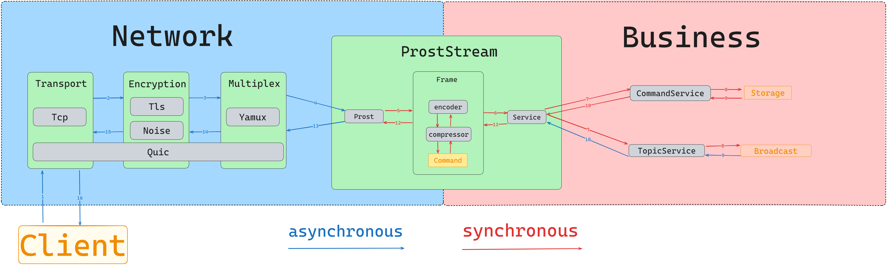

# 🚧CCKVServer🚧
This is project for me to practice how to build a KV server from 0 to 1.
# Architecture

# Feature
- Basic Storage function and Pubsub
- various data backend supported, including in-memory map, embedded db, etc.
- Noise protocol is supported in encryption layer besides Tls
- Multiplexing is supported by Yamux or QUIC
- custom frame data encapsulation format with a four-byte header for each data frame, including length, compression status, and compression format.
# Usage
### Running Locally
First, clone the repository and navigate to the project directory:

```sh
git clone https://github.com/WiccyCheng/CCKVServer.git
cd yourproject
```
server:
```sh
cargo run --bin kvs
```
client:
```sh
cargo run --bin kvc
```
### Running from a Release
Go to the [releases page](https://github.com/WiccyCheng/CCKVServer/releases/) and download the appropriate binary for your operating system.
## Commands
> Client will show the detailed usage instructions for each command 
* Hget
* Hgetall
* Hmget
* Hset
* Hmset
* Hdel
* Hmdel
* Hexist
* Hmexist
* Publish
* Subscribe
* Unsubscribe

# Benchmark
### Pubsub
started the server and 100 subscribers and benchmarked the publishing operation. The results are as follows:
```plaintext
publishing              time:   [76.341 µs 76.824 µs 77.390 µs]
                        change: [-0.6231% +0.9935% +2.7754%] (p = 0.29 > 0.05)
```
The average time for a single publish operation is 76.341 microseconds. which is approximately 13,097 publish operations per second.
### 🚧More Bench...🚧